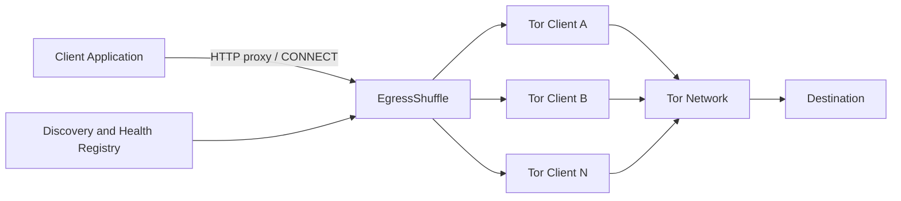

# EgressShuffle

EgressShuffle is a self-hosted HTTP/HTTPS forward proxy that distributes new
outbound connections across a dynamically discovered pool of independent Tor
clients. Applications use one proxy endpoint; EgressShuffle handles Docker DNS
discovery, health-aware selection, SOCKS5 translation, and operational
telemetry.

EgressShuffle provides backend-level distribution across independent Tor
clients. It does **not** guarantee a unique source IP for each request, force
Tor circuit rotation, or provide an anonymity guarantee.

## Features

- HTTP forwarding and HTTPS `CONNECT` tunneling through Tor SOCKS5
- Dynamic Docker DNS discovery with safe reconciliation during lookup failures
- Round-robin, random, and least-connections balancing
- Threshold-based SOCKS5 health checks and optional end-to-end checks
- Conservative pre-transmission backend failover
- Prometheus metrics and structured JSON logs
- Separate liveness, readiness, metrics, and version endpoints
- Optional constant-time HTTP Basic proxy authentication
- Graceful shutdown for HTTP requests and hijacked tunnels
- Non-root, read-only containers and localhost-only host bindings
- Deterministic integration tests using a local fake SOCKS5 server

## Non-goals

EgressShuffle does not implement browser automation, fingerprint spoofing,
CAPTCHA solving, user-agent rotation, crawling, application-level retries,
Tor `ControlPort` orchestration, or forced identity rotation. It is not a tool
for bypassing bans, rate limits, access controls, or anti-abuse systems.

## Architecture



Only EgressShuffle publishes host ports. Tor SOCKS ports are exposed solely on
the internal Docker network. Each Tor replica is a separate process and
container with independent runtime state. See
[`docs/architecture.md`](docs/architecture.md) for request, discovery, health,
failure, and shutdown flows.

## Quick Start

Requirements: Docker Engine with Docker Compose v2.

```bash
git clone https://github.com/rasooll/egressshuffle.git
cd egressshuffle
docker compose up --build --scale tor=3
```

Tor bootstrap and health convergence can take a minute. In another terminal:

```bash
curl http://127.0.0.1:9090/readyz
curl --proxy http://127.0.0.1:8080 https://example.com
```

Stop the stack with:

```bash
docker compose down
```

## Usage

HTTP request:

```bash
curl --proxy http://127.0.0.1:8080 http://example.com
```

HTTPS through `CONNECT`:

```bash
curl --proxy http://127.0.0.1:8080 https://example.com
```

With optional proxy authentication enabled:

```bash
curl --proxy http://127.0.0.1:8080 \
  --proxy-user 'proxy-user:proxy-password' \
  https://example.com
```

The proxy supports conventional HTTP clients. It is not a transparent proxy;
clients must explicitly configure an HTTP proxy endpoint.

## Configuration

Configuration is read from environment variables and validated before any
listener starts. Docker Compose has usable defaults and does not require an
`.env` file. `.env.example` documents a complete configuration.

| Variable | Default in binary | Purpose |
| --- | --- | --- |
| `PROXY_ADDRESS` | `127.0.0.1:8080` | Proxy listener; Compose uses `0.0.0.0:8080` inside the container |
| `ADMIN_ADDRESS` | `127.0.0.1:9090` | Admin listener; Compose uses `0.0.0.0:9090` inside the container |
| `TOR_SERVICE_NAME` | `tor` | Docker DNS service name |
| `TOR_SOCKS_PORT` | `9050` | Tor SOCKS5 port |
| `DISCOVERY_INTERVAL` | `10s` | DNS discovery interval |
| `LOAD_BALANCER` | `round_robin` | `round_robin`, `random`, or `least_connections` |
| `CONNECT_TIMEOUT` | `15s` | Per-backend SOCKS5 connection timeout |
| `REQUEST_TIMEOUT` | `60s` | Whole ordinary HTTP request timeout |
| `IDLE_TIMEOUT` | `90s` | HTTP server idle timeout |
| `HEADER_TIMEOUT` | `10s` | Inbound header timeout |
| `SHUTDOWN_TIMEOUT` | `15s` | Graceful shutdown deadline |
| `BACKEND_HEALTH_INTERVAL` | `10s` | Health check interval |
| `BACKEND_HEALTH_TIMEOUT` | `5s` | Health operation timeout |
| `BACKEND_FAILURE_THRESHOLD` | `3` | Failures required to mark unhealthy |
| `BACKEND_SUCCESS_THRESHOLD` | `2` | Successes required to mark healthy |
| `MAX_BACKEND_RETRIES` | `2` | Additional distinct backend attempts before transmission |
| `TOR_E2E_HEALTHCHECK_ENABLED` | `false` | Enable an external HTTP check through each backend |
| `TOR_E2E_HEALTHCHECK_URL` | empty | Operator-controlled check URL |
| `LOG_LEVEL` | `info` | `debug`, `info`, `warn`, or `error` |
| `LOG_FORMAT` | `json` | `json` or `text` |
| `PROXY_AUTH_ENABLED` | `false` | Require HTTP Basic proxy authentication |
| `PROXY_AUTH_USERNAME` | empty | Required when authentication is enabled |
| `PROXY_AUTH_PASSWORD` | empty | Required when authentication is enabled |

Compose-only host bindings are `PROXY_BIND=127.0.0.1:8080`,
`ADMIN_BIND=127.0.0.1:9090`, and
`PROMETHEUS_BIND=127.0.0.1:9091`. `STOP_GRACE_PERIOD` must remain longer than
`SHUTDOWN_TIMEOUT`. The listener addresses, Tor service name, and SOCKS port
should retain their supplied values with the bundled Compose topology; changing
them also requires matching port, network, Tor, and Prometheus changes.

## Scaling

Scale Tor without restarting EgressShuffle:

```bash
docker compose up -d --scale tor=10
docker compose up -d --scale tor=2
```

The `tor` service has no `container_name`, fixed replica list, or published
port. EgressShuffle resolves all service addresses every
`DISCOVERY_INTERVAL`, deduplicates and sorts them, preserves state for retained
addresses, adds new addresses, and removes disappeared addresses. A failed DNS
lookup retains the last known set.

Membership changes appear after approximately `DISCOVERY_INTERVAL`; readiness
of new backends additionally requires health-check convergence. Scaling does
not imply linear throughput, and independent Tor clients may select the same
exit relay.

## Load Balancing

- `round_robin`: cycles through healthy backends in deterministic registry order.
- `random`: selects a healthy backend using a concurrency-safe process-local PRNG.
- `least_connections`: chooses the healthy backend with the fewest active proxied connections.

Selection occurs for each new HTTP request or `CONNECT` tunnel. Active counts
are incremented only after SOCKS5 connection establishment and released on all
close paths.

## Health Checking

The base check opens a TCP connection and completes a SOCKS5 unauthenticated
greeting. Consecutive thresholds prevent flapping across the transitions
`unknown -> healthy -> unhealthy -> healthy`.

The base check proves that Tor accepts SOCKS5, not that a usable exit circuit
already exists. Enable `TOR_E2E_HEALTHCHECK_ENABLED` with a stable URL under
your control when stronger readiness is required. The external check runs
through the backend and shares the strict backend health timeout.

## Observability

Admin endpoints:

| Endpoint | Meaning |
| --- | --- |
| `GET /healthz` | Process liveness |
| `GET /readyz` | Initial discovery completed and at least one backend is healthy |
| `GET /metrics` | Prometheus exposition |
| `GET /version` | Version, commit, build time, and Go version |

Prometheus metrics include request totals and duration, active connections,
backend and healthy-backend counts, per-backend active connections and
connection outcomes, discovery runs/errors, and health check outcomes. Labels
use bounded methods, results, load-balancer names, and opaque backend IDs.
Destinations, client addresses, query strings, and request IDs are never metric
labels.

Start optional Prometheus on `127.0.0.1:9091`:

```bash
docker compose --profile observability up --build --scale tor=3
```

Logs default to JSON. They include request correlation and outcomes but exclude
credentials, headers, bodies, cookies, query strings, and destination URLs.

## Security

Compose publishes proxy and admin ports only on `127.0.0.1`. Changing a bind to
`0.0.0.0` can create an open proxy or expose operational data. If remote access
is required, enable authentication and place EgressShuffle behind a trusted,
encrypted network boundary. HTTP Basic credentials and plain HTTP proxy traffic
are otherwise visible in transit.

Destination hostnames are encoded in the SOCKS5 request and resolved by Tor,
not by EgressShuffle's normal DNS resolver. Docker DNS is used only to discover
the `tor` service. Applications can still leak identity through payloads,
cookies, TLS behavior, or other identifiers.

See [`docs/security.md`](docs/security.md) for the threat model and limitations.

## DNS Behavior

For `example.com:443`, EgressShuffle sends the literal hostname in the SOCKS5
connect request. It does not call the local resolver for destination names.
Literal client-supplied IP addresses remain literal IP addresses. The optional
end-to-end health URL follows the same SOCKS5 path.

## Operations

Operational procedures for startup, shutdown, scaling, upgrades, capacity, and
configuration changes are in [`docs/operations.md`](docs/operations.md).
Useful checks include:

```bash
docker compose ps
docker compose logs egressshuffle
docker compose logs tor
curl http://127.0.0.1:9090/readyz
curl http://127.0.0.1:9090/metrics
```

## Development

Requirements: Go 1.24 or newer, Docker, Docker Compose v2, Make, and Bash.
See [`CONTRIBUTING.md`](CONTRIBUTING.md) for the contribution workflow,
engineering standards, and security reporting guidance.

```bash
make build
make run
make check
make docker-build
```

`make run` starts the binary directly and therefore requires
`TOR_SERVICE_NAME` and `TOR_SOCKS_PORT` to identify a Tor service reachable
from the host.

`make check` verifies formatting, runs normal and race-enabled tests, vets the
code, and builds the binary with metadata.

## Testing

```bash
make test
make test-race
make smoke-test
```

Unit tests cover configuration, registry reconciliation, health transitions,
load balancing, headers, authentication, retries, metrics, and readiness.
Integration tests run a fake SOCKS5 server and local HTTP/TLS servers to verify
HTTP forwarding, HTTPS `CONNECT`, remote hostname handling, failover, no replay
after transmission, and forced tunnel shutdown. Automated tests do not require
Tor or public Internet access. The smoke test does require a running Compose
stack and public Tor connectivity.

## Troubleshooting

See [`docs/troubleshooting.md`](docs/troubleshooting.md) for failure-specific
diagnostics. A `503` from `/readyz` normally means discovery has not completed
or health thresholds have not yet produced one healthy backend.

## Limitations

- Tor bootstrap may lag behind successful SOCKS5 greeting checks.
- Independent Tor clients can choose the same exit relay.
- Tor controls circuit lifetime; EgressShuffle does not rotate identities.
- Ordinary HTTP requests have a fixed request timeout; `CONNECT` tunnels do not have a global lifetime timeout.
- No application request is retried after a SOCKS5 connection has been returned to the HTTP transport.
- Runtime state and metrics are process-local and non-persistent.
- Capacity is bounded by CPU, memory, file descriptors, Tor behavior, destination behavior, and network conditions.
- Docker network isolation is defense in depth, not a substitute for host security.

## Authorized Use

Use EgressShuffle only for systems and networks you own or are explicitly
authorized to test, such as privacy-preserving outbound testing, controlled
integration tests, and authorized networking research. Operators are
responsible for complying with applicable law, destination policies, and Tor
network expectations.

## License

Apache License 2.0. See [`LICENSE`](LICENSE).
