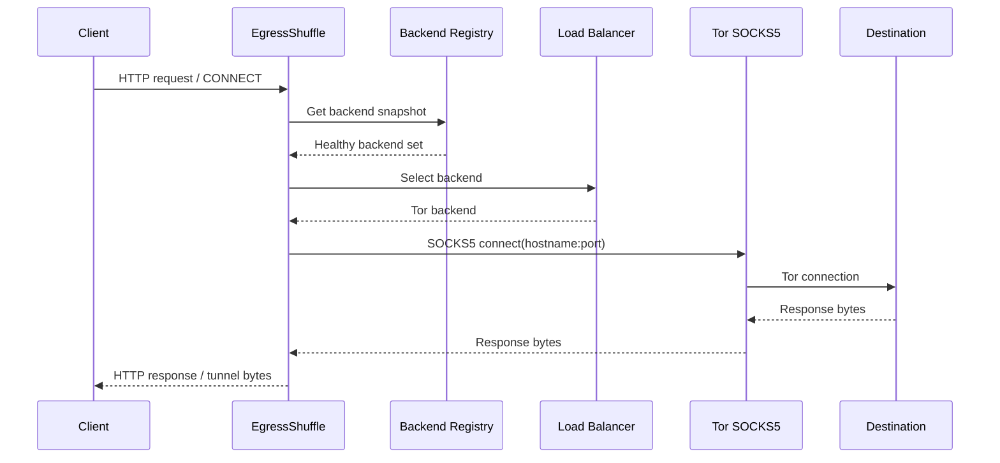
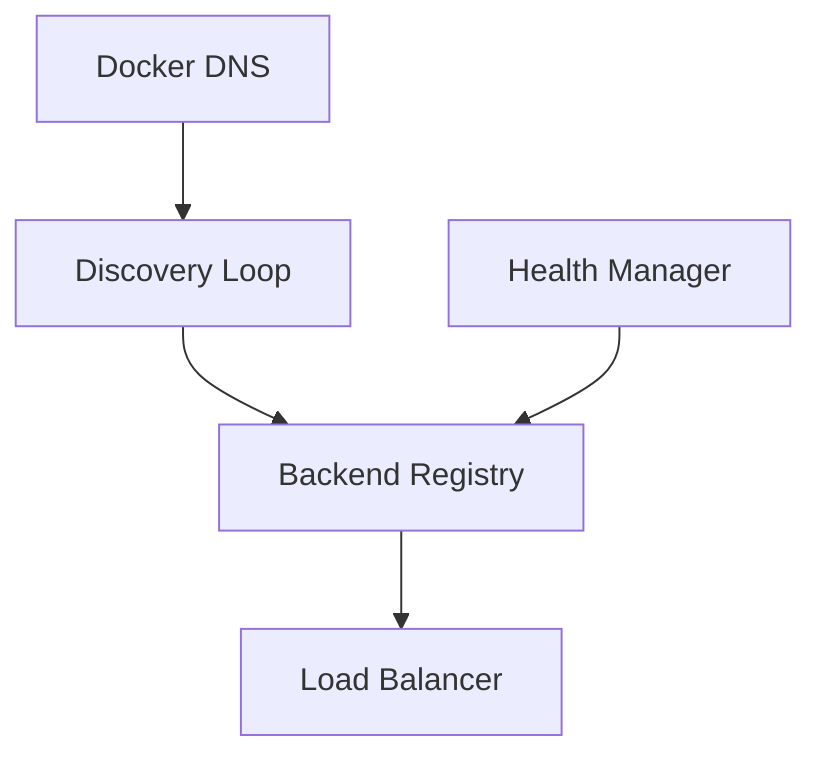
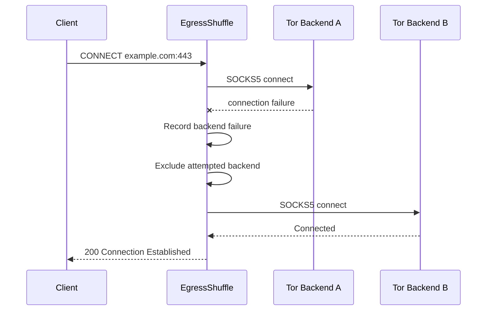
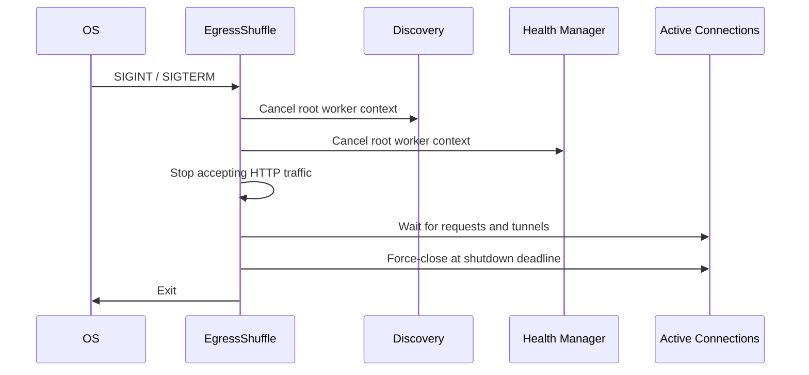

# Architecture

## Components

EgressShuffle has one stateless Go router and a dynamically changing set of Tor
containers. The router owns four runtime concerns:

- DNS discovery reconciles Docker service addresses into the registry.
- Health management records thresholded SOCKS5 availability.
- A load balancer selects only healthy registry entries.
- The proxy translates HTTP and `CONNECT` into SOCKS5 connections.

The registry preserves a backend object while its normalized address remains in
DNS. Runtime identity is intentionally ephemeral: an opaque ID is a truncated
SHA-256 digest of the current address. Addresses are never exposed in metrics
or routine logs.

## Trust Boundaries

Clients can reach the router only through host-published proxy and admin ports.
Compose binds both to loopback. Router-to-Tor traffic uses `tor_internal`, an
internal Docker network. Tor replicas additionally attach to `tor_egress` for
Internet access. The router attaches to `client_ingress` so Docker can publish
host ports. Tor publishes no host port.

Container network isolation limits accidental reachability; it is not a strong
sandbox against a compromised Docker daemon, host, or process.

## Request Flow

For ordinary HTTP, EgressShuffle validates an absolute `http` URL, removes
hop-by-hop and proxy credentials, and creates a one-request transport. Its
custom dial function establishes SOCKS5 before `net/http` writes request bytes.
The response is streamed and hop-by-hop response headers are removed.

For `CONNECT`, the router validates `host:port`, establishes SOCKS5, and only
then hijacks the client connection and emits `200 Connection Established`.
Copy loops propagate EOF with `CloseWrite` where supported. Active tunnels are
registered so shutdown can wait and ultimately force-close them.

## Discovery and Health

Each discovery pass resolves `TOR_SERVICE_NAME`, accepts valid IP answers,
normalizes them with `TOR_SOCKS_PORT`, deduplicates, and sorts them. Successful
answers atomically add and remove membership. Existing pointers remain, which
preserves health and active counts. A resolver error records a metric and does
not reconcile an empty set, so a transient Docker DNS failure cannot erase all
known backends.

The health manager snapshots the registry and checks backends concurrently.
The base check completes both TCP connect and the SOCKS5 method greeting. A
backend becomes healthy after `BACKEND_SUCCESS_THRESHOLD` successes and
unhealthy after `BACKEND_FAILURE_THRESHOLD` failures. New entries start
unknown and are ineligible for selection.

Expected scale convergence is roughly `DISCOVERY_INTERVAL` plus enough
`BACKEND_HEALTH_INTERVAL` periods to satisfy the success threshold.

## Failure and Retry

`MAX_BACKEND_RETRIES` counts additional distinct backend attempts. Retry occurs
inside the dial function before a connection is returned to HTTP handling.
Once the dial succeeds, EgressShuffle does not replay a request if writing,
reading, TLS, or the destination fails. This rule applies to all methods and
avoids unsafe replay of request bodies.

## DNS Path

Docker DNS resolves only Tor service membership. Destination hostnames are
validated syntactically and encoded as SOCKS5 domain-name addresses. Tor then
resolves the destination through its path. The fake SOCKS5 integration test
uses intentionally unresolvable local hostnames to enforce this boundary.

## Timeouts

- Listener header reads use `HEADER_TIMEOUT`.
- SOCKS5 dial and handshake use `CONNECT_TIMEOUT`.
- Ordinary HTTP handling uses `REQUEST_TIMEOUT` for the complete operation.
- Health operations use `BACKEND_HEALTH_TIMEOUT`.
- Server keep-alive uses `IDLE_TIMEOUT`.
- Coordinated shutdown uses `SHUTDOWN_TIMEOUT`.

`CONNECT` tunnels do not inherit `REQUEST_TIMEOUT`; long-lived tunnels are
valid. They terminate on peer closure, I/O failure, or forced shutdown.

## Shutdown

The standard HTTP servers own normal requests. A separate tunnel registry owns
hijacked connections because `http.Server.Shutdown` does not. All shutdown
operations share one deadline.
